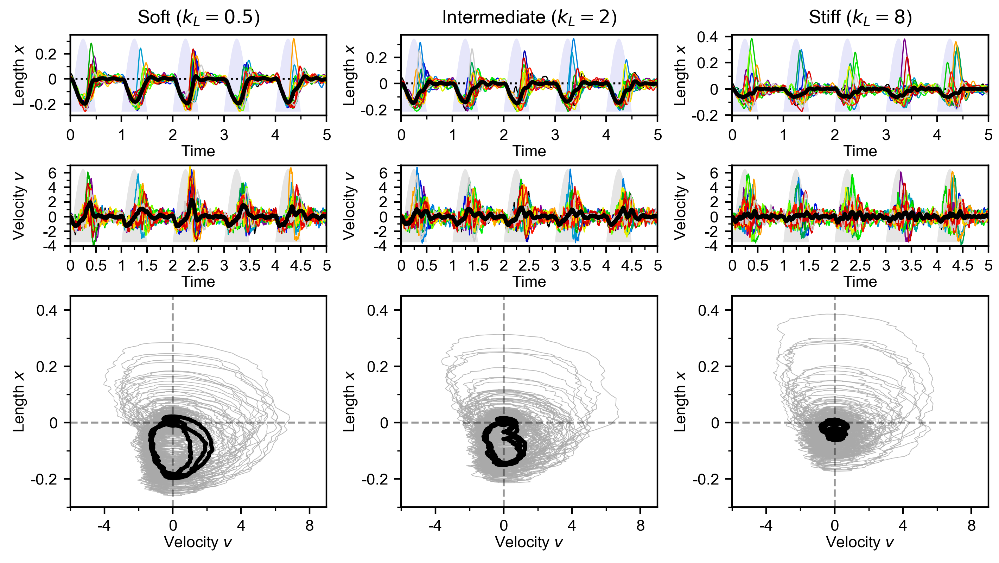

# Sarcomere Dynamics Model

Code accompanying the paper **"Sarcomere dynamic instability and stochastic heterogeneity drive robust cardiomyocyte contraction"** by Haertter et al.

## Manuscript

The latest version of the manuscript is available on bioRxiv:
- [bioRxiv preprint](https://www.biorxiv.org/content/10.1101/2024.05.28.596183)

The version of the manuscript reviewed by eLife (prior to revision) can be found here:
- [eLife reviewed preprint](https://elifesciences.org/reviewed-preprints/97321)

## Overview

This repository contains a mesoscopic computational model of coupled sarcomeres in cardiac myofibrils. The model reveals how stochastic fluctuations and a non-monotonic force-velocity relationship generate complex collective dynamics including tug-of-war competition, high-frequency oscillations, and transient "popping" events.

<p align="center">
  
</p>
<p align="center">
  <em>Figure: Simulated sarcomere dynamics under different substrate stiffnesses. Top row: length trajectories with activation (shaded). Middle row: velocity trajectories. Bottom row: phase space (velocity vs. length) showing transition from large-amplitude tug-of-war (soft) to synchronized contractions (stiff). Individual sarcomeres in color, average in black.</em>
</p>


## Installation

This project uses [UV](https://github.com/astral-sh/uv) for dependency management.


Clone repository

```bash
git clone https://github.com/yourusername/sarcomere-model
cd sarcomere-model
```
Install UV (if not already installed)

```bash
curl -LsSf https://astral.sh/uv/install.sh | sh
```

Create virtual environment and install dependencies
```
uv sync
```

Activate virtual environment
```
source .venv/bin/activate # Linux/macOS
```
or
```
.venv\Scripts\activate # Windows
```
### Alternative: Using pip
```
pip install -e .
```

## Quick Start

### Running Simulations

```
from model import Model, ModelParams, SimParams

# Define model parameters
model_params = ModelParams(
    N=20,              # Number of sarcomeres
    mu=0.006,          # Inertia parameter
    eta=[2.2, 9.0],    # Thermal and active noise amplitudes
    k_l=2.0,           # Load stiffness
    k_s=[3.0, 3.0, 3.2],  # Sarcomere stiffness parameters
    u_s=[0.1, 0.05],   # Friction coefficients
    f_s=[-0.77, -0.06, 0.10, 0.01],  # Force-velocity relation coefficients
    h=0.0              # Force heterogeneity (STD)
)

# Define simulation parameters
sim_params = SimParams(
    t1=5.0,           # Simulation duration (s)
    dt=0.002,         # Time step (s)
    a_mode='sine',    # Activation mode
    a=[1.0, 0.0, 1.0],  # [frequency, baseline, amplitude]
    p=0.0             # Pre-strain
)

# Create and run model
model = Model(model_params, sim_params, folder='results', autosave=True)
model.integrate()
model.analyze()
```

### Comparing Substrate Conditions

```
from dataclasses import replace

# Test different substrate stiffnesses
stiffnesses = [0.5, 2.0, 8.0]  # Soft, intermediate, stiff

models = []
for k_l in stiffnesses:
    params = replace(model_params, k_l=k_l)
    model = Model(params, sim_params)
    model.integrate()
    models.append(model)
```

## Model Structure

```
├── model.py              # Core model implementation
│   ├── ModelParams       # Model parameter dataclass
│   ├── SimParams         # Simulation parameter dataclass
│   └── Model             # Main simulation class
├── analysis.py           # Analysis functions
│   ├── analyze_trajs()   # Extract contraction extrema
│   ├── analyze_popping() # Detect popping events
│   └── correlation_cycles_mutual_serial()  # Correlation analysis
├── plots.py              # Visualization functions
└── utils.py              # Helper functions
```

## Data Format

### Saving/Loading Parameters

```
# Save parameters
model_params.save_json('params.json')
sim_params.save_pickle('params.p')

# Load parameters
model_params = ModelParams.load_json('params.json')
sim_params = SimParams.load_pickle('params.p')

# Load complete model
model = Model.load_model('results', name='abc12345', format='pickle')
```

### Output Data Structure

```
model.data = {
    'time': np.array,           # Time points
    'act': np.array,            # Activation signal
    'length': np.array,         # Sarcomere lengths (N × T)
    'vel': np.array,            # Sarcomere velocities (N × T)
    'length_avg': np.array,     # Average length
    'vel_avg': np.array,        # Average velocity
    'contr_max': np.array,      # Maximal contractions
    'popping_events': np.array, # Popping event markers
    'corr_length_mutual': float,  # Mutual correlation
    'corr_length_serial': float,  # Serial correlation
    # ... additional analysis results
}
```

## Citation

If you use this code, please cite:

```
@article{haertter2025sarcomere,
  title={Sarcomere dynamic instability and stochastic heterogeneity drive robust cardiomyocyte contraction across loads},
  author={Haertter, Daniel and Hauke, Lara and Driehorst, Til and Nishi, Kengo and Zimmermann, Wolfram-Hubertus and Schmidt, Christoph F.},
  journal={eLife},
  year={2025}
}
```

## Data Availability

Experimental data and additional analysis scripts are available at: [Zenodo link]

## License

MIT License. Copyright (c) 2025-2026 Daniel Härtter.